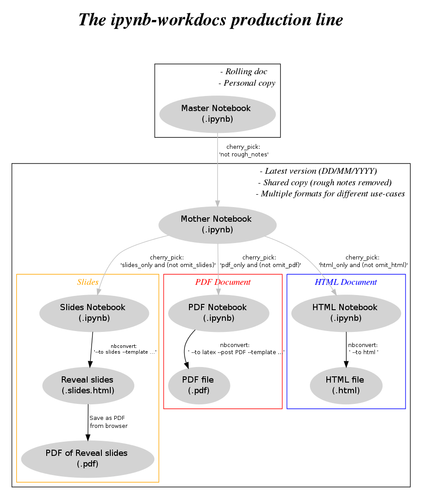

# ipynb workdocs 

A simple system for reproducible research documentation.

## What's this then? 

The aim is to facilitate a document-as-you-go workflow for research and other
walks of life.

Three important features of such a workflow are:

1. **Reproducibility**. Including *speed of*, *transparency of* and *ease of*.
2. **Efficiency**. I don't want to spend additional time going back and
documenting what I've done. I want to do it along the way. And I don't want to
have to make different files for documenting and sharing and presenting stuff in
different contexts. That leads to diffusion of information (across multiple
files) and rapid propagation of multiple files.

This pitch is not original and in fact is becoming increasingly recognized and
en vogue. And as a result the good people at IPython have developed a number of
excellent tools that facilitate these objectives.

With *ipynb workdocs* I am simply applying these tools in the way that best
suits the needs of myself, my colleagues, and anyone else who might find it
useful.

The bread and butter of this is the simple research report, of the 'here you go
boss, this is what I did, and this is what the result was' variety. Could be the
summary of a few hours' work or a few days' work. The key thing is to have as an
end-product

- an ipython notebook, from which are generated
- a pdf
- a static html file ( + web link, e.g. nbviewer)
- a web-based slideshow (e.g. slideviewer or gh-pages)
- possibly also: sphinx web pages, rst, markdown
- if at all possible: something like a powerpoint type file

As far as possible the notebook should be one-click runnable to reproduce any
analysis and figures content. For long analyses or when data access is highly
restricted this may not be practicable all of the time, but this should be the
aim.

Again, these all come pretty easily from IPython tools that are becoming pretty
standard. I'm just providing templates and extra functions so that I one can sit
down and crack these out a rapid pace.

## Enough talk. How does it work?

The basis idea is that you have a 'master' notebook containing 'everything',
which is then wittled down for specific use cases.

There are two steps of 'wittling'.

- Remove all rough notes from the master notebook.
- Convert this smartened-up notebook to static html, PDF and slides.

The input to the first stage is the master notebook. The input to the second
stage is the output from the first stage.

What gets snipped is defined by a custom set of cell tags. To do this I am using
modified versions of the tools provided in jonathan frederic's 'notebook cherry
picker' repo.

At present I have four 'modes of consumption' in mind:

- *in-notebook* - for everyday use and 'on the ground' discussion/sharing with
colleagues
- *nbviewer* - effectively a static website. All analysis and figures code is
retained; similar sharing function as above but with a more permanent reference
location
- *pdf* - For summaries and dissemination. Long analysis code is snipped out.
- *slides* - For meetings and talks. Only key summary bullet points and figures
used.

As a general rule, the idea is to try to use the same cells for nbviewer, PDF,
and slides. But the system allows for specific additions or exclusions for each
of these.

## Setup:

*Cell tags*

Follow the instructions in the cherry-picker repo to set up a set of 'ipynb-workdocs' tags, including: *rough_notes*, *pdf_only*, *html_only*, *slides_only*, *omit_pdf*, *omit_html*, *omit_slides*. 

Make sure that the notebook_cherry_picker submodule in this repo is checked out on the 'ipynb-workdocs' branch (sometimes this doesn't seem to be the case by default). 

## Examples:

(see 'examples' folder)

[Example 1](http://nbviewer.ipython.org/github/JohnGriffiths/ipynb-workdocs/blob/master/examples/example1__nbconvert_cells/example1__master_nb.ipynb) - nbconvert calls from master notebook cells   

[Example 2](http://nbviewer.ipython.org/github/JohnGriffiths/ipynb-workdocs/blob/master/examples/example2__utils_function/example2__master_nb.ipynb) - nbconvert function call from ipynb wd utils  

Example 3 - nbconvert widget (planned)  

Example 4 - nbconvert pure python (planned)  

